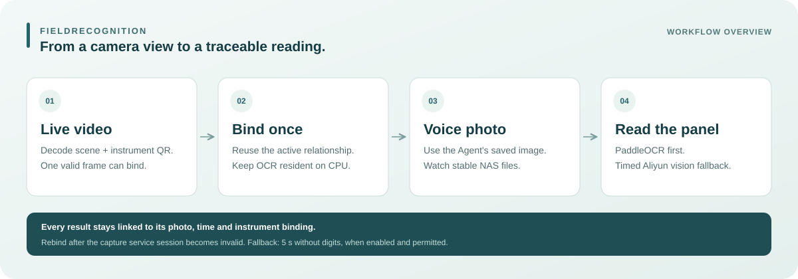
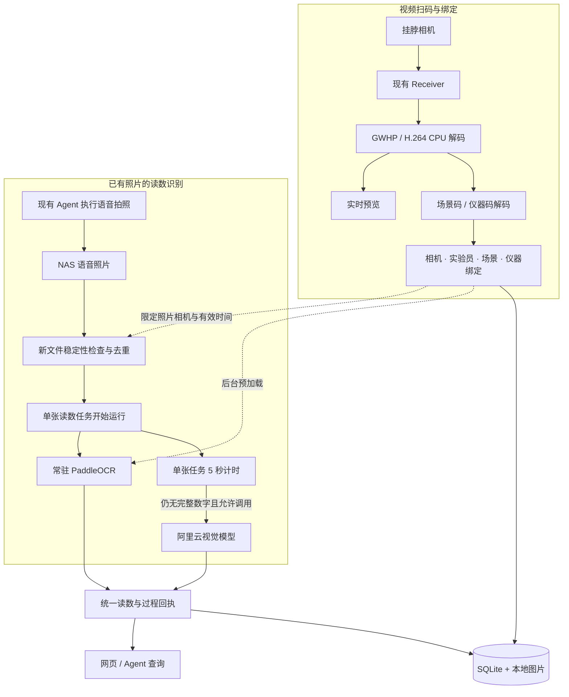

<div align="center">


<h1>FieldRecognition</h1>

<p><strong>挂脖相机扫码绑定 · 语音照片面板读数</strong></p>

<p>面向实验现场的仪器识别与读数系统。<br>用实时视频确认正在使用的仪器，用已有 Agent 的拍照结果读取面板，让每次识别都有照片、时间和绑定记录可查。</p>

<p>
  <a href="技术方案.md"><b>📐 技术方案</b></a> ·
  <a href="AgentTools.md"><b>🤖 Agent 接入</b></a> ·
  <a href="docs/运行与验证记录.md"><b>📚 部署与验证记录</b></a>
</p>

<p>
  <a href="#quick-start">快速开始</a> ·
  <a href="#architecture">系统架构</a> ·
  <a href="#workflow">使用流程</a> ·
  <a href="#evaluation">验证与边界</a>
</p>

<p>
  
  
  
  
</p>

</div>

## ✨ 项目介绍

在实验现场，记录一个面板数字，还需要知道它来自哪台仪器、由谁操作、照片拍于何时。FieldRecognition 将这些信息放进同一次使用流程：实验员让挂脖相机依次扫到场景码和仪器码，建立绑定；需要读数时，对现有 Agent 说“拍照”，系统读取该相机保存到 NAS 的新照片，识别面板并保留原图与结果。

视频扫码持续寻找有效二维码，**实际处理的一帧解出唯一且场景匹配的仪器码，即可完成绑定**。有效绑定期间无需为每次读数重复扫码；设备采集服务离线或采集会话变化后，需要重新绑定。绑定成功即在本地后台加载 PaddleOCR，后续照片复用常驻模型；单张读数任务运行 5 秒仍无完整数字候选时，按配置调用阿里云视觉模型兜底。



本仓库提供识别服务、网页和 Agent HTTP 工具。挂脖设备、Receiver、Agent 的语音与拍照服务、NAS 保存流程由现有系统提供。当前实现面向**单个配置相机、本地 CPU 推理**，完整机制与实现边界见 [技术方案](技术方案.md)。

### 核心能力

| 能力 | 当前实现 |
|---|---|
| 🎥 **连续视频扫码** | 接收 H.264 主码流，使用 ZXing / OpenCV 解码新鲜帧；唯一合规二维码命中后自动进入场景或绑定仪器。 |
| 🔗 **会话内持续绑定** | 保存相机、实验员、场景、仪器的关系；重复提交沿用原绑定，设备采集服务会话失效后结束旧关系。 |
| 📷 **复用语音拍照** | 监控当前绑定相机的 NAS 新照片，等待文件稳定后导入；照片和任务持久化去重，保留源文件。 |
| 🔢 **常驻本地 OCR** | 绑定后后台加载 CPU PaddleOCR；对具体照片执行识别，支持手动框选面板，后续任务复用模型。 |
| ☁️ **视觉模型兜底** | 单张任务运行 5 秒无完整数字时尝试阿里云视觉识别；页面统一展示读数，后台保留两条识别路径的回执。 |
| 🧾 **结果可追溯** | 保存图片引用、SHA-256、拍摄与接收时间、绑定快照、选框和模型原始结果；提供网页查询与九个 Agent 工具。 |

## 🗞️ 项目进展

- **2026-09-11**：发布连续视频扫码、采集服务会话绑定、OCR 常驻、NAS 语音照片监控与视觉兜底实现，以及完整技术方案。发布前 66 项自动测试通过；现场验证状态见[验证与边界](#evaluation)。

<a id="quick-start"></a>

## 🚀 快速开始

### 1. 安装并启动

以下命令面向已安装 `uv` 的新环境，使用项目独立的 Python 3.11 虚拟环境：

```bash
git clone https://github.com/kealan-Jun/FieldRecognition.git
cd FieldRecognition

uv python install 3.11.15
uv venv --python 3.11.15 .venv
uv pip install --python .venv/bin/python -r Requirements.lock.txt

OMP_NUM_THREADS=2 OPENBLAS_NUM_THREADS=2 \
  .venv/bin/python -m uvicorn app:app --host 127.0.0.1 --port 8188
```

打开 [http://127.0.0.1:8188](http://127.0.0.1:8188)。不配置 Receiver 时，可先通过照片上传和仓库中的 [二维码样张](static/labels/) 体验场景与仪器绑定。仪器的名称、型号和所属场景在网页登记。

模型权重不随仓库分发。首次成功绑定后会在后台加载 OCR；缺少缓存时可能下载权重，加载完成后留在本地识别服务内存中。若已有用户服务占用 8188，请直接使用现有页面。

### 2. 接入挂脖相机与语音照片

配置项模板见 [.env.example](.env.example)。手动启动需要先设置环境变量；程序不会自动读取 `.env`。使用 systemd 部署时，由[用户服务模板](deployment/field-recognition-demo.service)加载该文件。安装步骤和已有服务的配置方式见[部署与运行记录](docs/运行与验证记录.md)。

| 配置项 | 用途 |
|---|---|
| `FIELD_RECEIVER_URL`、`FIELD_CAMERA_ID` | Receiver 地址与目标相机标识；需支持本项目使用的 GWHP 主码流协议。 |
| `FIELD_SAVED_PHOTO_ROOT` | 已挂载的语音照片根目录，例如 `/mnt/realityloop-nas/voice_photos`。 |
| `FIELD_SAVED_PHOTO_WATCH_ENABLED=1` | 开启有效绑定相机的新照片监控。 |
| `FIELD_SAVED_PHOTO_TIMEZONE` | 照片文件名时间的时区，默认 `Asia/Shanghai`。 |
| `DASHSCOPE_API_KEY`、`FIELD_ALIYUN_FALLBACK_ENABLED=1` | 配置阿里云凭证并启用视觉兜底；凭证只放环境变量或未跟踪的 `.env`。 |
| `FIELD_ALIYUN_MODEL` | 本版配置为 `qwen3.8-max`，实际可用性以账户和服务区域为准。 |
| `FIELD_ALIYUN_NO_DIGITS_SECONDS` | 单张任务无完整数字候选的等待时间，默认 `5` 秒。 |

照片目录需符合以下布局，日期与时间必须相互匹配；支持 `.jpg`、`.jpeg`、`.png`：

```text
voice_photos/
└── <camera_id>/
    └── YYYY-MM-DD/
        └── HH-MM-SS/
            └── YYYYMMDD_HHMMSS[_序号].jpg
```

接收协议、文件稳定性检查、时间过滤和去重规则详见[技术方案](技术方案.md)。

<a id="architecture"></a>

## 🛠️ 系统架构



| 组成 | 主要技术 | 负责什么 |
|---|---|---|
| 视频与二维码 | PyAV、ZXing-C++、OpenCV | 解码主码流、显示实时画面、从码内容取得场景或仪器 ID。 |
| 绑定与任务 | FastAPI、SQLite | 校验关系、维持绑定生命周期、派发读数任务、持久化去重。 |
| 照片与识别 | 文件轮询、Pillow、PaddleOCR | 导入具体语音照片，纠正图片方向，执行文本检测与识别。 |
| 视觉兜底 | HTTPX、阿里云视觉接口 | 发送本次照片或选框，校验返回结构，保留请求回执。 |
| 交互与集成 | HTML / JavaScript、HTTP JSON 工具 | 展示预览与读数，支持框选、历史查询和 Agent 适配。 |

二维码的 JSON 载荷、制作示例、解码策略、OCR 检测与识别原理、并发调度、数据库和全部接口，都在[技术方案](技术方案.md)中逐节展开。

<a id="workflow"></a>

## 🧩 使用流程

1. **登记并扫码。** 填写仪器信息和实验员，点击“连续扫码绑定”，依次对准场景码、仪器码。唯一且符合场景的仪器码成功解码后自动绑定；多个候选需要手动选择。
2. **保持本次绑定。** 绑定成功后停止扫码，视频预览继续，OCR 在后台加载。刷新页面或重复提交沿用原绑定；设备采集服务离线或会话变化后，重新上线需要重新扫码，也可主动结束绑定。
3. **说“拍照”。** 用户对现有 Agent 发起拍照，照片写入该相机的 NAS 目录。服务只接收本次有效绑定之后的新照片，文件稳定后自动创建读数任务。网页也支持上传照片和框选识别。
4. **读取面板。** 常驻 OCR 先处理该照片；任务开始 5 秒仍没有完整数字候选时，满足配置与调用间隔条件就尝试视觉兜底。每个任务最多一次云端请求，同一绑定两次尝试至少间隔 30 秒。
5. **核对并留存。** 网页自动刷新显示统一读数；无法看清时保留无读数结果。后台保存原图引用、时间和识别过程，可查询历史或导出 JSON。

Agent 如果需要在对话里播报识别结果，可通过 `get_field_state` 和 `get_panel_result` 查询。已有拍照回执也可直接交给 `read_saved_panel`。工具参数、返回结构和 Python 示例见 [AgentTools.md](AgentTools.md)；本仓库尚未修改现有 Agent 的聊天或播报逻辑。

<a id="evaluation"></a>

## 📊 验证与边界

以下状态来自 **2026-09-11 的已有验证**。`PROVEN` 表示列明的有限检查已经完成；`PARTIAL_EVIDENCE` 表示只覆盖部分环节；`NOT_PROVEN` 表示还缺少对应现场验收。自动测试数量、模型置信分数与真实仪器准确率是不同指标。

| 验证项 | 状态 | 已有证据与尚缺环节 |
|---|---|---|
| 解码、绑定、照片去重、异步与兜底规则 | `PROVEN` | 发布前 66 项自动测试通过，使用临时数据与模型 / HTTP 替身；覆盖范围见 `tests/`。 |
| 真实挂脖视频接入与预览 | `PROVEN` | 已取得 1280 × 800 主码流；一次预览检查在约 3.2 秒内收到 45 张不同 JPEG，约 14 fps，不代表二维码识别吞吐。 |
| 本地 OCR 常驻与模型调用 | `PROVEN` | 已检查真实 CPU 模型加载、复用和合成面板预测；尚不能由此推断物理仪器准确率。 |
| 语音照片导入与视觉兜底 | `PARTIAL_EVIDENCE` | 已只读解析实际 NAS 照片；合成输入已跑通真实 OCR → 约 5 秒等待 → 真实云端调用。真实语音拍照到物理仪器读数的整条链路待验收。 |
| 采集服务停启后重新绑定 | `PARTIAL_EVIDENCE` | 已读取接收端会话字段，失效规则通过模拟测试；实际设备服务停启闭环待验收。 |
| 现场标签连续扫码与面板读数准确率 | `NOT_PROVEN` | 早期 12 张挂脖实拍均未成功解码；仍需清晰现场标签、真实面板样本和人工真值进行验收。 |

原始回执保留在本机 `Verification/`，不随 Git 分发。测试范围、历史结果和回执路径见[运行与验证记录](docs/运行与验证记录.md)及[技术方案](技术方案.md)。

当前实现还具有以下边界：

- **设备会话判断：** 使用 Receiver 的在线状态和 `rgb_ingress_session_id`；设备重连或 Receiver 重启也可能改变该字段。严格区分设备进程重启与网络重连，需要上游提供稳定的服务实例 ID。
- **照片识别范围：** 自动监控默认识别整张照片，尚未自动定位面板；数字候选可能识别错误，低模型分数本身不触发兜底。照片须对准当前绑定仪器，结果仍需核对。
- **部署与身份：** 当前为单个配置相机、CPU 推理、默认本机访问。二维码是未签名的演示身份码，不能作为防复制凭证；面板文字不构成物理操作证明。

运行自动测试时，在项目根目录执行：

```bash
env -u FIELD_RECEIVER_URL -u FIELD_CAMERA_SNAPSHOT_URL \
  OMP_NUM_THREADS=2 OPENBLAS_NUM_THREADS=2 \
  .venv/bin/python -m pytest -q tests
```

## 📂 仓库结构

```text
FieldRecognition/
├── app.py                          # HTTP 服务、数据存储与 OCR 生命周期
├── receiver.py                     # Receiver 接入与 H.264 解码
├── qr_decode.py                    # 二维码解码与增强重试
├── live_scan.py                    # 连续扫码与采集会话判断
├── scene_binding.py                # 场景进入与绑定校验
├── photo_watch.py / saved_photo.py  # NAS 照片监控、导入与去重
├── panel_readout.py                 # 本地识别与超时兜底调度
├── aliyun_vision.py                 # 阿里云视觉调用与结果校验
├── agent_tools.py / agent_client.py # Agent 工具与 Python 适配器
├── static/                         # 网页、项目标识与二维码样张
├── InstrumentRegistry.json         # 仪器初始登记
├── SceneRegistry.json              # 场景初始登记
├── tests/                          # 自动测试
├── deployment/                     # systemd 用户服务模板
├── docs/                           # 概览图、运行与历史验证记录
├── .env.example                    # 配置模板，不含实际凭证
├── Requirements.lock.txt           # 锁定依赖
├── AgentTools.md                   # 工具接口与接入示例
└── 技术方案.md                      # 各模块机制与完整实现说明
```

运行时的 `Data/` 保存本地图片与数据库；`Verification/`、`VerificationData/`、`output/`、`tmp/` 为本地验证或交付材料。这些目录、虚拟环境、模型权重、日志及密钥均不纳入 Git。

## 📋 后续工作

- [ ] 完成现场仪器标签连续扫码和设备采集服务停启的联合验收。
- [ ] 完成真实语音拍照 → NAS 新文件 → 当前仪器读数的现场闭环。
- [ ] 建立不同仪器、距离、角度、反光条件下的人工标注样本与准确率评测。
- [ ] 引入面板区域定位和更细的读数质量判断。
- [ ] 对接稳定的设备服务实例 ID，并按部署需求补充身份认证与多相机调度。

项目介绍的组织方式参考 [JoyAI-VL-Interaction](https://github.com/RealityLoopAI/JoyAI-VL-Interaction)。FieldRecognition 的功能、技术栈和验证结论均以本仓库实现为依据。
