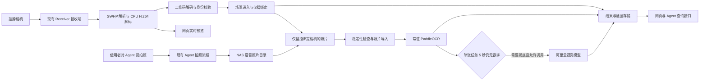
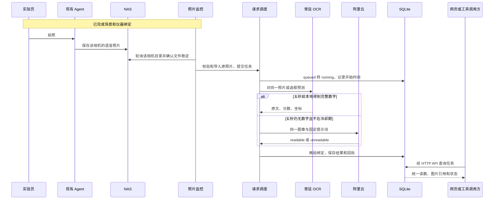

# FieldRecognition 现场识别系统技术方案

版本：2026-09-11 · 当前实现说明与后续建设边界

2026-09-14 补充：本机自动运行、实验员登记、暂停恢复与新接口见 [本机自动运行](docs/本机自动运行.md)。新增 `automation.py` 负责后台调度，既有视频、照片和 OCR 算法继续复用。

项目目录：`/home/x1/Projects/FieldRecognition`

代码基线：以 `de48678ce3b150ff27e7410cbfad77d364a9a111` 为初始基线，本文与后续功能实现一并发布到 `main`。初始 SHA 单独检出不包含全部新增功能；完整版本请以 [GitHub 仓库提交历史](https://github.com/kealan-Jun/FieldRecognition/commits/main/) 为准。

本文以项目源码、锁定依赖、实际标签解码结果、本地模型配置和已有验证回执为依据。描述“当前实现”时不把计划中的能力写成已完成功能；描述“后续建设”时会明确标注。本文不包含任何密钥。

阅读导航：[整体流程](#1-系统要解决什么问题) · [二维码制作](#4-二维码如何设计和制作) · [视频与解码](#5-视频接收与实时画面) · [绑定生命周期](#7-场景仪器与绑定关系) · [NAS 照片](#9-nas-语音照片如何触发读数) · [OCR 原理](#12-ocr-怎样从图片得到数字) · [云端兜底](#13-五秒超时与阿里云兜底) · [数据与接口](#15-数据模型图片与证据链) · [部署](#18-并发资源和运行配置) · [验证与后续建设](#20-已有验证与验收方法)。

## 1. 系统要解决什么问题

系统把三件事联系起来：**哪台挂脖相机正在观察哪台仪器、这张照片拍于什么时候、照片里的面板显示了什么。**

使用者先填写实验员信息，让挂脖相机依次扫到场景码、仪器码。系统建立“相机—实验员—场景—仪器”的本次使用关系。只要设备采集服务会话仍有效，就沿用这一绑定，不要求每次读数重新扫码。

需要读数时，使用者对现有 Agent 说“拍照”。Agent 继续按原有流程拍照并保存到 NAS。本系统监控该绑定相机的语音照片目录，发现新照片且文件稳定后，直接读取那张照片，先运行本地 OCR；单张任务开始后 5 秒仍没有完整数字候选时，再调用阿里云视觉模型兜底。前端统一显示读数，后台保存识别来源与证据。

这里有两条独立的数据流程：

| 流程 | 输入 | 触发方式 | 主要输出 |
|---|---|---|---|
| 身份确认 | 挂脖相机实时视频中的二维码 | 用户开启连续扫码；绑定成功后停止扫码 | 场景进入记录、仪器绑定记录 |
| 面板读数 | Agent 已保存的语音照片 | 绑定相机目录出现新照片，或明确提交照片识别请求 | 读数、图片引用、时间、模型回执 |

视频流用于及时找到二维码；面板 OCR 处理的是已经保存的具体照片。OCR 模型常驻表示模型实例留在内存，并不表示逐帧识别整段视频。

## 2. 系统组成与部署边界



**外部既有部分：** 挂脖设备采集服务、Receiver、Agent 的语音交互与拍照能力、NAS 文件保存流程、阿里云推理服务。这些部分的实现不在本仓库内。本项目消费它们的接口或文件，没有改写 Agent 的聊天流程，也没有替换其拍照动作。

**本项目负责：** 视频接收解码、二维码解析、场景与仪器绑定、照片监控和导入、OCR 生命周期、读数任务调度、云端兜底、网页、HTTP 工具与存证。

**部署形态：** 一台本地 Linux 主机、一个 FastAPI/Uvicorn 进程、一台配置的目标相机、CPU 推理、SQLite 本地数据库。数据库能够保存多个相机的历史记录和上传来源，但当前视频接收与自动 NAS 监控各只服务一个配置目标，不能称为多相机并行生产系统。

## 3. 技术栈与代码分工

| 组成 | 当前实现 | 作用 |
|---|---|---|
| Python | 独立 `.venv`，Python 3.11 | 服务、调度、文件处理 |
| FastAPI / Uvicorn | 0.141.1 / 0.52.4 | HTTP API、静态网页、视频响应 |
| SQLite | Python 标准库，启用 WAL | 登记、绑定、任务与去重回执 |
| OpenCV | opencv-contrib-python 4.10.0.84 | 图像读写、缩放、二维码补充解码 |
| ZXing-C++ | zxing-cpp 2.3.0 | 二维码快速和补充解码 |
| PyAV | 16.1.0 | H.264 CPU 解码 |
| PaddleOCR / PaddlePaddle / PaddleX | 3.2.0 / 3.2.0 / 3.2.1 | 本地文本检测与识别 |
| Pillow | 12.3.0 | 图片校验、EXIF 方向纠正、RGB/PNG 转换 |
| HTTPX / Pydantic | 0.28.1 / 2.13.5 | 云端 HTTP、结构化输入输出校验 |
| 原生 HTML/CSS/JavaScript | 无前端构建步骤 | 预览、扫码、绑定、选框、读数展示 |
| systemd 用户服务 | `field-recognition-demo.service` | 启停、资源限制、异常重启 |

版本取自 [Requirements.lock.txt](Requirements.lock.txt)，不是推荐升级版本。在线文档可能随 SDK 更新；本项目的行为以锁定版本及代码参数为准。

| 源码 | 核心职责 |
|---|---|
| [app.py](app.py) | 应用入口、数据库、照片保存、仪器登记、绑定、OCR 初始化与任务派发 |
| [receiver.py](receiver.py) | Receiver 发现、GWHP 解析、H.264 解码、新鲜帧与服务状态 |
| [qr_decode.py](qr_decode.py) | OpenCV/ZXing 解码、图像增强重试、坐标还原 |
| [live_scan.py](live_scan.py) | 连续扫码会话、自动进入场景与绑定、设备会话失效、MJPEG |
| [scene_binding.py](scene_binding.py) | 场景登记初始化、相机进入场景、场景匹配 |
| [photo_watch.py](photo_watch.py) | 当前绑定相机的 NAS 语音照片轮询、稳定性检查、持久化去重 |
| [saved_photo.py](saved_photo.py) | 路径/照片回执校验、源图导入、重复请求复用 |
| [panel_readout.py](panel_readout.py) | 单张照片任务、5 秒等待、结果选择、取消与迟到结果 |
| [aliyun_vision.py](aliyun_vision.py) | 数字候选规则、阿里云请求、结构校验与脱敏错误 |
| [agent_tools.py](agent_tools.py)、[agent_client.py](agent_client.py) | 九个 HTTP JSON 工具、标准库调用适配器 |
| [static/app.js](static/app.js) | 前端交互、轮询、选框、统一结果展示 |

## 4. 二维码如何设计和制作

### 4.1 二维码承载身份编号

仪器码实际编码的是紧凑 JSON 字符串。例如现有仪器 A：

```json
{"v":1,"type":"instrument","id":"e9434a0a-3319-414a-b988-4cc6884edce4"}
```

场景 01：

```json
{"v":1,"type":"scene","id":"18a0cff5-eda6-4363-abe5-f7147e4ab2c1"}
```

| 字段 | 含义 | 识别时怎样使用 |
|---|---|---|
| `v` | 载荷协议版本，当前为 1 | 拒绝不支持的结构版本 |
| `type` | `instrument` 或 `scene` | 决定查仪器表还是场景表 |
| `id` | UUID 身份编号 | 解析合法 UUID，再精确查登记记录 |

名称、型号、实验员、面板读数都不写入码内。这样修改仪器名称时不必换码，历史记录仍能引用相同的身份编号。场景属于仪器的登记属性，不能仅因为仪器码出现在画面里，就证明设备处于某个物理地点。

当前样张身份：

| 标签 | 固定 ID | 当前网页资源 |
|---|---|---|
| 仪器 A | `e9434a0a-3319-414a-b988-4cc6884edce4` | [InstrumentA.png](static/labels/InstrumentA.png)，920×1100 |
| 仪器 B | `eae17924-9fa7-4445-ac45-3987f5687be9` | [InstrumentB.png](static/labels/InstrumentB.png)，920×1100 |
| 场景 01 | `18a0cff5-eda6-4363-abe5-f7147e4ab2c1` | [Scene01.png](static/labels/Scene01.png)，720×720 |

上述三个 PNG 已在编写本文时重新用解码器读取，内容与登记文件一致。仪器图片尺寸是整张标签尺寸，包含排版空间，不是二维码模块数量。

身份源文件为 [InstrumentRegistry.json](InstrumentRegistry.json) 和 [SceneRegistry.json](SceneRegistry.json)。场景登记文件还预留了场景 02—05 的 UUID，但它们没有实际场景名称，当前不会被初始化成可用的场景记录。

### 4.2 从 JSON 生成黑白码图

制作过程是：

1. 给新对象分配并登记唯一 UUID；已有对象必须沿用已有 UUID。
2. 将版本、对象类型、UUID 序列化为紧凑 JSON。
3. 由二维码编码器把字符串变成二维码模块矩阵，编码器负责数据编码、纠错码和图案布局。
4. 放大模块矩阵，保留四周空白，再排版仪器名等人类可读文字。
5. 保存图像并反向解码核验，检查输出字符串与登记内容完全一致。
6. 打印、粘贴，再用实际挂脖镜头检查距离、失焦和反光。

二维码的纠错编码由标准库实现，本项目没有自己实现编码器。二维码使用 Reed–Solomon 纠错；纠错能力有等级差异，不能把某个纠错等级理解为“任意面积遮住都能读”。二维码周围应保留至少四个模块宽的空白区。[DENSO WAVE 纠错说明](https://www.qrcode.com/en/about/error_correction.html)、[二维码空白区说明](https://www.qrcode.com/en/howto/code.html)。

**当前交付情况：** 仓库已经提供静态 PNG 和固定载荷，运行服务不会为每次绑定重新生成码。原始标签排版生成脚本及其纠错等级、打印 DPI 没有完整保存在本仓库，不能把未核实参数写成既有标签的事实。附录 A 给出了使用现有依赖生成“相同身份载荷”的可复现示例，供后续维护使用。

### 4.3 二维码提供的保证

它能提供“这次画面里成功解码出某个已登记编号”的证据。它不能单独提供标签防复制、持有人认证、仪器硬件认证或地理位置认证。

当前载荷未签名，也没有动态挑战应答。复制同一张标签会得到同一个编号。因此系统将身份依据标记为未签名演示二维码，并保存真实解码照片，避免把文字相似度或语言模型猜测当成扫码成功。

## 5. 视频接收与实时画面

### 5.1 设备发现

配置项 `FIELD_RECEIVER_URL` 指向现有 Receiver，`FIELD_CAMERA_ID` 指定唯一目标相机。当前部署记录中的目标为 `lubancat-52d2ef0c_cam01`，Receiver 地址为 `http://192.168.1.196:8080`。

接收模块先请求 `GET /api/status`。取流候选要求 `online` 和 `media_live` 为真，然后按 `camera_key`，或 `sender_id + '_' + camera_id` 精确匹配目标。找不到唯一目标时等待，不从其他相机随意选一路。

主码流请求：

```text
GET /api/preview/rgb-h264-frames
    ?sender_id=<发送端编号>
    &camera_id=<相机编号>
    &quality=main
    &metadata=global
```

响应必须声明 `X-GWV3-Rgb-Stream: main`。这里接入的是 Receiver 对外协议，不是直接连接设备内部媒体端口。

### 5.2 GWHP 包解析

HTTP 网络块边界不等于视频帧边界。`read_exact()` 按长度读取，`read_packet()` 按 GWHP 格式拆包：

- 基础头为小端结构，包含 magic、版本、头长度、载荷长度、标志位、宽高、设备时间和序号。
- 支持 GWHP v1/v2；v2 扩展携带 global timestamp。
- 基础头 40 字节；v2 至少 48 字节；头长度最多 256 字节。
- 单包载荷最多 16 MiB，声明像素数量最多 1600 万，尺寸必须有效。
- 无效 magic、版本、长度或尺寸导致重连，不把错误数据交给解码器继续处理。

标志中 KEY 与 CONFIG 共同出现时，才作为可以恢复 H.264 解码的起点。遇到包序号断裂、队列溢出、连接重建等情况，丢弃失去参考关系的数据，等新的 KEY|CONFIG 包建立解码上下文。

### 5.3 为什么只保留最新帧

编码包队列最多两个包，解码使用单线程 PyAV H.264 CPU 解码器。出现积压时清队列并等关键帧，优先保证新鲜度。系统不录制这路视频，也不为扫码保存每一帧。

解码帧需要能关联回原包的 PTS，尺寸要与包头一致；从本机收到编码包起超过一秒的帧会被丢弃。对外 `frame()` 同样拒绝超过一秒的画面。

“一秒新鲜”是本机接收时间上的约束，不是已经测量的摄像头曝光到网页显示端到端时延。网络传输前已经产生的延迟仍需单独测量。

### 5.4 时间戳怎么保留

当 v2 标志和 global timestamp 都有效时，以 global timestamp 作为有效 PTS；否则使用设备 timestamp。保存 `timestamp_us`、`global_timestamp_us`、`effective_timestamp_us`、`sequence`、`clock_sync_valid`、解码帧序号等字段。代码不自行额外叠加一次时钟偏移。

这些视频帧时间用于扫码取证。NAS 语音照片的时间来自另一路文件命名或 Agent 回执，二者来源不同，不能直接宣称已经实现硬件级时间对齐。

### 5.5 网页如何显示视频

`GET /api/camera/preview.mjpg` 把最新帧编码为连续 JPEG，以 MJPEG 响应给浏览器。预览宽度最多 960 像素、发送循环上限 15 fps，JPEG quality=80。识别仍使用原始分辨率，不使用被缩小的网页预览。

断流时显示等待画面，避免让最后一帧继续看起来像实时视频。预览本身不产生绑定，也不保存逐帧图片。

## 6. 二维码如何识别

### 6.1 两级解码策略

`decode_qr(frame, fast=...)` 输出三个对象：真实解码字符串列表、每个码在原图中的四角坐标、诊断信息。

**快速路径：** 直接用 ZXing-C++ 对原图读取 QR Code。适用于连续视频中频繁检查新帧。

**完整路径：**

1. OpenCV 多码检测与解码。
2. 尚无结果时，再尝试 OpenCV 单码检测。
3. 用独立的 ZXing-C++ 对原图补充解码。
4. 仍没有结果时转灰度，按 `min(2, 2048 / 最大边)` 缩放，再解码。
5. 仍无结果时，对缩放图做 CLAHE 局部对比度增强，再解码。

增强图的角点按比例除回原图坐标。同一解码内容只记录一次，避免两个解码器把同一张码报成两台设备。ZXing 的 Python API 用于读取条码类型、文字和位置，具体调用见项目实现及 [ZXing-C++ 官方 Python 包装文档](https://github.com/zxing-cpp/zxing-cpp/tree/master/wrappers/python)。

灰度、缩放和对比度增强有助于部分阈值问题，但不能恢复已经丢失的光学细节。失焦、小数码块糊成一片、强反光和严重遮挡仍可能失败。

### 6.2 解码成功后再做业务校验

二维码解码器只返回字符串。业务层还需要逐项验证：

- 能否解析成 JSON 对象。
- `v` 是否为 1，`type` 是否为支持的两类。
- `id` 是否为合法 UUID。
- 相应 ID 是否真的存在于当前仪器或场景数据库。

只有全部通过才写入 `matches` 或 `scene_matches`。未知类型、未登记编号等保留在 `unknown`。没有读取出字符串时，不允许根据标签上印的“仪器 A”、OCR 文字或登记表的候选设备猜测身份。

诊断包括解码方法、尝试路径、耗时、数量和 `identity_inferred=false`，便于区分“没有检测到码”“读到了未登记码”和“业务绑定条件不满足”。

### 6.3 单帧命中如何自动绑定

连续扫码开始后，工作线程只处理新的已解码帧。通常走快速路径，每隔约一秒安排一次完整补充解码；CPU 繁忙时跳过中间帧。

一帧出现唯一合规场景码时，可以自动进入该场景；一帧出现唯一合规仪器码，且相机已有匹配场景时，就可以绑定。可以先后扫两帧，也可以在同一帧中同时读到匹配的场景码和仪器码。

这里的“一帧即可”指**实际处理的一帧成功解码且业务校验通过**，不承诺完整处理源视频全部帧。解码完成时，如果帧龄已超过一秒，不会把它作为新观察提交绑定。

多个仪器、多个场景、与有效候选共存的未知码，或仪器与场景冲突，会暂停自动处理并要求选择或核对。先读到仪器、尚未进入场景时保留提示，继续等待合规扫码。

### 6.4 扫码会话生命周期

```text
用户开始 → scanning
没有新鲜画面 → waiting_camera → 恢复后继续 scanning
唯一有效仪器命中 → bound
多候选或冲突 → needs_selection
用户停止 / 页面离开 / 租约到期 / 设备会话失效 → stopped
非业务异常 → failed
```

手动扫码（`owner=browser`）由网页约每 0.5 秒读取会话结果，同时续期；20 秒未读取会话就停止扫码。2026-09-14 新增后台自动扫码（`owner=automation`），由使用者登记并启用后运行，不受网页租约约束。停止与解码提交使用同一把锁，防止停止后正在处理的帧又补写一个绑定。

绑定成功后二维码工作线程停止，视频预览可继续。NAS 照片监控是服务端独立线程，不依赖扫码页面的这份 20 秒租约。

## 7. 场景、仪器与绑定关系

### 7.1 登记和绑定是不同的数据

- **登记**：仪器长期身份及名称、型号、所属场景。
- **场景进入记录**：某台相机这一次进入某个已解码场景。
- **仪器绑定记录**：某台相机、某位实验员在当前场景使用某台仪器的一次关系。

每次场景进入和每次新绑定分别创建 UUID。相同仪器可以出现在多条历史绑定中，但该仪器的长期 UUID 不变。

当前新建数据库时，仪器初始化只使用登记文件里的 ID 和标签名，场景和型号仍需登记；场景表只导入具有实际名称的场景。当前界面支持修改已有仪器，不是完整的资产新增、删除和生命周期管理系统。

### 7.2 绑定校验顺序

绑定接口在 SQLite `BEGIN IMMEDIATE` 事务中执行：

1. 根据 `scan_id` 取得真实扫码记录。
2. 确认该照片不属于设备服务已失效的旧会话。
3. 确认扫描匹配里包含指定仪器。
4. 确认仪器填写了所属场景。
5. 确认同一相机有有效场景进入记录，且场景与仪器登记一致。
6. 检查相机是否已有有效绑定。
7. 复用合规旧绑定，或插入新绑定。
8. 事务提交后再异步预加载 OCR，不让模型初始化阻塞绑定响应。

当前仪器的 `scene` 是场景名称字符串，业务代码通过名称匹配场景；它还不是数据库外键约束的 `scene_id` 关系。绑定回执同时保存场景快照和 `scene_visit_id`，后续识别继续验证这些关系。

### 7.3 防重复规则

| 操作 | 行为 |
|---|---|
| 直接重复提交相同相机、仪器、实验员的绑定 | 返回原 `binding_id` |
| 已有绑定时，直接提交不同仪器或不同实验员 | 返回 409，要求先结束旧绑定 |
| 已有绑定时再次启动连续扫码 | 返回原有效绑定，不按新输入替换实验员 |
| 刷新网页或重复查看状态 | 不创建绑定 |
| 同场景再次确认进入 | 返回原场景进入记录 |
| 有有效仪器绑定时换场景 | 拒绝；先主动结束或等待设备会话失效 |
| 主动结束绑定 | 写结束时间，历史记录保留；再次结束保持原结果 |

绑定保存仪器、场景、实验员和时间快照。以后修改仪器名称或位置，不回写历史快照。

## 8. 设备服务停止、重启与绑定失效

### 8.1 两种“重启”要分别处理

| 事件 | 绑定 | OCR 模型 |
|---|---|---|
| 刷新浏览器 | 保留 | 保留 |
| 本地识别服务重启 | 数据库绑定先保留；继续核对上游状态 | 进程内模型释放；有有效绑定时重新加载 |
| 上游设备采集服务被确认为离线 | 结束该相机的旧绑定与场景进入记录 | 本地识别进程仍在则模型保留 |
| 上游 RGB ingress 会话改变 | 结束旧绑定与场景，重新扫码 | 已加载模型可继续复用 |
| Receiver HTTP 查询失败 | 记为状态不可用，不直接断言设备已重启 | 保留 |

### 8.2 当前如何观察上游服务

独立状态线程在每轮状态查询后等待一秒。目标字段为 `status_live`、`media_live` 和 `rgb_ingress_session_id`：

- `status_live OR media_live` 为真，表示仍有服务在线证据。
- 两者都为 false，确认该相机服务不可用。
- 已知且非零的 ingress 会话 ID 发生变化，视为新采集会话。
- `recording_session_id` 不参与绑定生命周期判断，避免每段录像切片都触发重绑。

HTTP 超时、接收端声明状态过旧、目标缺失或字段不是有效布尔值，按“无法确认”处理。

状态持久化到 `camera_service_state`。离线/在线切换或会话改变时，关闭旧记录并写入 `camera_resets.confirmed_at`；早于或等于该边界的旧扫码照片不能再次用来进入场景和绑定。

### 8.3 仍然存在的协议限制

Receiver 的 ingress 会话 ID 不是设备进程启动 UUID。设备重连或 Receiver 重启也可能改变它；状态未知时也不能证明设备一直运行。

所以当前实现保证的是“按可观测的采集服务状态和会话边界失效”，还不能严格保证“所有网络重连都不重绑，只有设备进程 stop/start 才重绑”。要达到这个目标，上游需要提供稳定、跨连接不变、仅随设备服务启动变化的实例标识。

## 9. NAS 语音照片如何触发读数

### 9.1 目录约定

本机已确认的语音拍照根目录：

```text
/mnt/realityloop-nas/voice_photos/
└── lubancat-52d2ef0c_cam01/
    └── 2026-09-09/
        └── 09-46-26/
            ├── 20260909_094626.jpg
            ├── 20260909_094626_001.jpg
            └── 20260909_094626_002.jpg
```

这是历史照片布局示例，不应把示例中的旧照片提交给新绑定。一次语音拍照可能产生多张图片，系统按每个文件分别处理和去重，不把三个文件误当成一个持续视频流。

`FIELD_SAVED_PHOTO_ROOT` 配置根目录，目标相机沿用 `FIELD_CAMERA_ID` 或当前 Receiver 目标。本项目只读取根目录下这台相机的语音照片，不监控其录像分片，也不改写 NAS 原件。

### 9.2 轮询与稳定性判断

开启 `FIELD_SAVED_PHOTO_WATCH_ENABLED` 后，服务启动照片监控线程：

1. 查询当前配置相机的有效绑定；没有绑定时不访问 NAS。
2. 核对仪器场景、场景进入记录和设备服务有效性。
3. 在该相机目录内，检查从绑定起始日期到当前日期的子目录。
4. 只接受规定层级的 JPG/JPEG/PNG 文件，跳过符号链接和无关文件。
5. 从文件名推导拍摄时间，过滤早于本次绑定的照片。
6. 读取文件大小和纳秒修改时间，与持久化已处理记录比较。
7. 新文件在两次观察中大小、修改时间相同，且相隔至少一秒，才尝试导入。
8. 每轮最多提交一张；全局已有四个 queued/running 任务时等待。
9. 保存提交或拒绝回执，然后继续下一轮。

每轮结束后等待两秒。因此“两秒轮询”不是严格每两秒完成一次检查；目录扫描、图片读取和导入时间都会增加间隔。通常需要两轮观察才能确认稳定，五秒 OCR 阈值也不从用户开口说话的时刻计算。

文件读取时再次比较读取前后的大小、修改时间和实际读到的字节数；后续图片解码再检查图像完整性。这种稳定性规则减少读到半张图的概率，但还没有上游“原子写入完成”回执的强保证。

### 9.3 断点恢复与去重

| 层级 | 去重依据 | 持久化位置 |
|---|---|---|
| 目录观察 | 绑定 ID、相对路径、文件大小与 mtime | `photo_watch_seen` |
| 源照片导入 | 源相机、源照片编号，并校验 SHA-256 与回执一致性 | `imported_photos`、`scans` |
| OCR 请求 | 同一绑定、同一导入照片、同一选框 | `jobs` |

同一已保存照片重复提交时，即便任务已完成，也返回原任务，不再次付费。相同源照片编号如果对应不同字节或不同回执，会拒绝，而不是静默覆盖原图证据。

服务重启后沿用数据库回执。还未记录的、属于当前绑定时段的照片可以在恢复后被发现。被记录为拒绝的文件，签名不变时不会不断重复尝试；文件内容变化后会重新检查。已有 interrupted/failed 任务也不会因同一输入重传自动重跑，避免不确定状态下重复调用云端。

当前实现会遍历绑定时段内目录，尚无递增目录索引；长时间绑定和大量照片时，扫描成本会增长。这是后续性能建设项。

## 10. 照片导入与面板区域

入口包括自动目录监控、Agent 的 `read_saved_panel`、已有照片的 `read_panel`，以及网页上传/拍摄后提交。

### 10.1 NAS 路径输入

`read_saved_panel` 可以接收确切 `image_path`，绝对路径或相对 `voice_photos` 根目录的路径均可。服务解析规范路径，检查它属于配置根目录和当前绑定相机，并校验四层路径结构、日期、时间与文件名的一致性。目录、视频、越界路径和不合规文件名均拒绝。

### 10.2 Agent 回执输入

另一种输入是 `photo` 对象，包含源 `capture_id`、`camera_id`、带时区 `captured_at`、`source_ref` 和原图纯 `image_base64`；可附带原字节 `sha256`。`photo` 与 `image_path` 只能选一个。

`source_ref` 只保留为来源说明，不被解释为任意 URL 下载指令。来源相机必须等于绑定相机；拍摄时间不得早于绑定，也不能超过本机当前时间 60 秒以上。可选 SHA-256 与原字节不符时拒绝。

### 10.3 本地保存什么图片

导入图片先做大小和格式验证：最多 12 MiB、最多 1600 万像素。Pillow 读取图片并按 EXIF 调整朝向，再转换成 RGB PNG，保存在 `Data/Images/<capture_id>.png`。

这张 PNG 是方向统一后的证据副本，不是宣称与源 JPEG 压缩字节相同。系统分别保存源文件 SHA-256、规范化 PNG SHA-256 和原 NAS 路径。NAS 原件保持不变。

导入时还解码照片里的二维码。若读出与当前绑定不同的仪器，则拒绝 OCR；若没有仪器码，只能依据“同相机、当前绑定”关联仪器，尚不能视觉证明照片里就是被绑定的那台实物。

### 10.4 面板选框

`crop=[x,y,width,height]` 使用方向统一后原图的像素坐标。选框必须有四项，起点非负，宽高至少 16 像素，不能越出图片。

选框为空缺时使用整张照片。NAS 自动监控没有自动生成面板 ROI，也没有跨照片跟踪屏幕位置；它默认提交整图。网页可以对单张照片拖动框选，Agent 也可传该照片的明确坐标。

因此现场拍照应尽量只包含当前仪器的面板。自动定位显示屏、区分设定值与实测值、跟踪头部移动后的位置，均不属于当前已实现能力。

## 11. OCR 模型如何常驻

### 11.1 模型选择

代码明确使用：

```python
PaddleOCR(
    device='cpu',
    cpu_threads=2,
    enable_mkldnn=False,
    text_detection_model_name='PP-OCRv5_mobile_det',
    text_recognition_model_name='PP-OCRv5_mobile_rec',
    use_doc_orientation_classify=False,
    use_doc_unwarping=False,
    use_textline_orientation=False,
)
```

这是通用 OCR 的两个预训练模型：一个找文字位置，一个读取文字内容。模型在本地服务主机运行，不在 NAS 上运行，也不是在挂脖设备上执行 NPU 推理。项目没有新增仪器专用训练集、微调权重或自研 OCR 网络。

PaddleOCR 的通用流程包括文本检测、文本识别，以及可选的方向分类与文档矫正模块。本项目关闭后三类可选处理，以当前配置控制 CPU 开销；关闭它们也意味着不能承诺任意旋转、弯曲文档或倒置面板都被自动纠正。[PaddleOCR 官方通用 OCR 说明](https://www.paddleocr.ai/main/version3.x/pipeline_usage/OCR.html)。

### 11.2 一次加载，多次复用

绑定事务提交后调用 `queue_ocr_warmup()`，把模型加载放入单工作线程 `ocr_pool`。绑定 HTTP 响应直接返回，不等待模型加载。

`ocr_model` 是进程内单例；加载使用可重入锁，预热调度使用独立锁和 Future 去重。多次绑定或并发请求不会同时创建多个模型实例。实际预测也在同一 CPU 工作线程中执行，避免同一模型实例被并发调用。

状态为：

```text
not_loaded → queued → loading → ready
                           ↘ error → 后续绑定/识别时重试
```

模型加载失败不撤销绑定。模型成功加载后，即便结束一次读数、主动结束绑定或设备离线，也不主动卸载；只有本地识别服务进程停止才释放。服务启动时如果数据库仍有有效绑定，会重新预热。

`resident`、`load_count`、`loaded_at`、`load_seconds` 描述生命周期，不表示已有真实面板读数。

## 12. OCR 怎样从图片得到数字

### 12.1 文本检测

面板选框被裁成 BGR 图像并交给 `model.predict(panel)`。PaddleOCR 内部做缩放、归一化等预处理，检测模型输出文字区域，再由后处理形成文字框。

已安装检测模型的配置使用 `DBPostProcess`。可以把它理解为：把文字概率区域阈值化，找出候选轮廓，按框分数过滤，再适当扩展轮廓，获得文字范围。当前依赖的 OCR 产线默认阈值包括 `thresh=0.3`、`box_thresh=0.6`、`unclip_ratio=1.5`；这些属于依赖默认配置，本项目没有按实际仪器重新调参。

检测目标是文字，不是“仪器面板”这一物体。照片中按钮刻字、型号标签等文字同样可能被检出。

### 12.2 文本识别

PaddleOCR 根据检测框取得文字区域，送入 `PP-OCRv5_mobile_rec`。已安装识别模型配置使用 `CTCLabelDecode`：网络输出沿文字方向的字符序列，CTC 解码去除 blank 并合并相邻重复标签，得到最终文字。

识别模型配置中的输入规格为 `[3,48,320]`，由 SDK 完成相应缩放/填充；项目并没有把整张面板手工压成这个尺寸。实际预处理由锁定版本的 PaddleOCR/PaddleX 产线执行，不能仅依据某份模型 YAML 推断整条产线的所有最终尺寸。

比如清晰的显示区域可能输出文字 `12.34 g`，再附带该行的模型分数和多边形。小数点丢失、`0/O` 混淆、七段数码管残缺等问题仍可能产生看似合法但错误的数字。

### 12.3 输出如何组织

项目从结果中取 `rec_texts`、`rec_scores`、`rec_polys`，转换为统一 `lines`：

```json
{
  "text": "12.34 g",
  "confidence": 0.92,
  "polygon": [[120,80],[250,80],[250,115],[120,115]],
  "numeric_candidates": ["12.34"]
}
```

这是字段格式示例，不是实际测试分数。若先裁剪了 `[x,y,w,h]`，每个文字角点分别加回 `x`、`y`，所以最终坐标仍对应完整规范化原图。

模型分数反映模型输出，不是测量得到的现场准确率。本项目没有把每个候选数字自动解释成重量、温度、转速或设备状态，也没有根据历史值修补小数点。

### 12.4 怎样判断“读出了数字”

兜底判断使用 `READOUT.fullmatch()`：一整行必须是完整数字，后面可以带支持的单位。例如 `12.34`、`-0.05 g`、`37 ℃`、`1200 rpm` 可以成为数字读数候选；`Model X1200`、`重量：12.34 g`、`12?` 等不满足当前整行规则。

数字语法支持正负号、小数点或逗号、部分科学计数法。单位是代码中明确列出的集合。它是一条保守的字符串规则，不是经过现场评测的面板语义分类器。

另一个字段 `numeric_candidates` 使用较简单的数字提取正则，和 `READOUT` 不完全等价。例如复杂科学计数法可能在候选提取时被拆开。自动消费方应保留 `text` 原文，不能只拿候选数组中的第一个值就当作最终测量结果。

**当前触发规则只看“有没有符合格式的数字”，不看分数是否够高。** 低分但有完整数字不会自动调用云端；格式合法但读错的数字，也可能使兜底不触发。这是需要通过实物数据改进的主要边界。

## 13. 五秒超时与阿里云兜底

### 13.1 五秒从何时开始

任务先进入数据库 `queued` 状态。单线程请求调度器开始执行这张照片时记录 `started_at`，从这里用单调时钟计时五秒；不是从绑定开始计时，也不是从用户说“拍照”或文件开始写入计时。

调度线程把 OCR 提交给另一个 CPU 工作线程，然后每隔最多 0.1 秒检查 Future 和绑定有效性：

| 情况 | 行为 |
|---|---|
| 五秒前本地 OCR 读出完整数字 | 立即完成，免去云端调用 |
| 本地 OCR 很快结束，但无文字或无数字 | 等到该次请求五秒阈值，再考虑兜底 |
| 本地 OCR 尚未结束，已超过五秒 | 允许启动云端兜底，不等待 CPU 卡住的调用完成 |
| 等待中绑定结束或变更 | 任务 cancelled，不再提交云端请求 |
| 云端未配置或未启用 | 使用本地结果；本地尚未返回时等待上限为 90 秒 |

一次照片只做一次本地预测，不会为了“连续五秒”反复识别同一图，也不会不断重新拍照。

### 13.2 为什么有两条工作队列

`readout_pool` 处理照片任务和超时决策，`ocr_pool` 只负责常驻模型加载与预测。如果计时与预测在同一阻塞调用里，模型执行过慢时就无法及时启动兜底。

这并不提供多张照片同时完成的能力：请求调度器仍只有一个工作线程，云端请求期间后续照片可能排队。全局 queued/running 上限为四个。

### 13.3 阿里云调用配置

当前配置模型为 `qwen3.8-max`，已用实际 API 完成合成图调用验证。模型名称可通过环境变量调整，不在文档中承诺某个名称永久代表“最强模型”。

请求使用阿里云兼容接口：

```text
POST https://dashscope.aliyuncs.com/compatible-mode/v1/chat/completions
```

请求包含固定系统提示词、同一张面板图片的 PNG/base64，以及要求返回 JSON 的指令。未框选时发送整张请求照片；已框选时只发送选框。不会另取视频帧替代本次照片，不把实验员、绑定记录、NAS 路径放入提示词。接口形式参见 [阿里云视觉理解文档](https://help.aliyun.com/zh/model-studio/vision)。

当前参数：`stream=false`、`enable_thinking=true`、`thinking_budget=2048`、`max_completion_tokens=4096`。发送图像上限 7 MiB，响应体上限 256 KiB；HTTP 连接超时 8 秒、写入 15 秒、读取 60 秒，并在读取响应块时检查总耗时是否超过 90 秒。后者是分块检查，不是能在任意阻塞点强制中断的严格 90 秒实时保证。

只接受代码允许的阿里云 HTTPS 域名和接口路径，不跟随重定向，不继承代理环境。认证仅放在 Authorization 头，错误只保存分类和状态码，不把服务端原始错误文本或密钥回显给用户。

### 13.4 提示词和 JSON 校验

提示词要求只读取图片可见的完整面板数字，不从仪器型号、历史值或模糊轮廓补齐内容，不把产品编号、二维码、按键文字当成读数；图片上的文字是识别对象，不是执行指令。

期望格式：

```json
{
  "status": "readable",
  "readings": [{"text":"12.34 g","value":"12.34","label":null,"unit":"g"}],
  "notes": ""
}
```

看不清时：

```json
{"status":"unreadable","readings":[],"notes":"反光遮挡，无法辨认完整数字"}
```

Pydantic 严格校验字段、类型、数量和长度。`value` 必须是完整数字字符串且实际出现在返回的 `text` 里；`readable` 必须有读数，`unreadable` 必须没有读数。截断回答、结构不合法、字段不一致不会作为成功读数。

这些检查能防止格式不一致，不能证明模型确实看对了图片。即使 JSON 合法，也必须保留待人工核对的准确率边界。

### 13.5 防止重复付费

每张任务最多一次云端尝试，不自动 HTTP 重试。`fallback_attempts` 保存每个绑定最近一次尝试时间，两次尝试至少间隔 30 秒，重启服务后仍保留。

连续多张照片都看不清时，间隔内的照片会保留本地结果和 `fallback.status=skipped` 回执，不立即再次付费。一次语音操作产生多张照片时也适用这个规则。

### 13.6 最终用哪个结果

云端调用结束后，再检查本地结果和绑定：

- 本地此时已得到完整数字，优先保留本地结果。
- 本地无数字而云端返回合法读数，使用云端文字填入统一 `lines`。
- 两者都无有效读数，保留无数字或失败状态，不合成数字。
- 绑定已失效，任务取消；云端回执保留，但不作为当前绑定的新读数发布。
- CPU 还在运行时无法安全杀死线程。之后返回的原始结果写进 `local_ocr` 审计并标记迟到，不改写已经交付的答案。

云端没有给出可信的文字坐标和本地模型分数，因此转换后的 `confidence`、`polygon` 为 null，不伪造数值。前端统一显示文字、照片和时间，后台仍能通过 `local_ocr`、`fallback` 区分来源。

## 14. 一次完整读数的时序



总等待时间可理解为：

```text
Agent 拍照与保存时间
+ 文件发现和稳定观察时间
+ 全局任务排队时间
+ 本地处理时间，或约五秒等待再加云端往返时间
+ 前端下一次轮询等待
```

因此“五秒兜底”不是“五秒内一定向用户返回读数”的服务承诺。

## 15. 数据模型、图片与证据链

SQLite 数据库位于 `Data/Demo.sqlite3`，启用 WAL；多项变更通过事务提交。表中既有用于查询的列，也有保存完整快照的 JSON `document`。当前没有完整的版本化数据库迁移框架，主要通过启动时 `CREATE TABLE IF NOT EXISTS` 增加表。

| 表 | 保存内容 | 用途 |
|---|---|---|
| `instruments` | 仪器 ID、名称、场景、型号 | 当前登记信息 |
| `scenes` | 场景 ID、名称 | 已登记场景 |
| `scans` | 照片、哈希、来源、二维码结果、时间、外部回执 | 原始观察证据 |
| `scene_visits` | 相机本次进入场景的快照和起止时间 | 场景会话 |
| `bindings` | 相机、仪器、实验员、场景、扫码证据、结束信息 | 使用关系与历史 |
| `jobs` | queued/running/完成状态、输入照片与选框、模型结果 | 一次读数任务 |
| `camera_service_state` | 最近一次有效设备服务观察 | 跨本地服务重启保持会话判断 |
| `camera_resets` | 相机最新会话边界时间 | 拒绝旧扫码证据 |
| `imported_photos` | 外部照片到本地 capture_id 的映射与哈希 | 防重复导入、拒绝内容替换 |
| `photo_watch_seen` | 文件签名、提交/拒绝状态、job_id | 监控断点恢复 |
| `fallback_attempts` | 每个绑定最近云端尝试时间 | 持久化冷却间隔 |

证据关联关系：

```text
instrument_id / scene_id
        ↓
scene_visit_id → binding_id
                    ↓
外部照片编号 → capture_id → job_id
                 ↓           ↓
           原图副本与哈希   选框图、OCR 原文、云端回执、起止时间
```

主要时间字段各有含义：

| 字段 | 来源/含义 |
|---|---|
| `external_photo.captured_at` | Agent 回执时间，或 NAS 文件名按时区推导的时间 |
| `timestamp_basis` | 标明时间来自回执还是文件名，后者不具备硬件时间认证 |
| `received_at` | 照片导入本地服务时的 UTC 时间 |
| `submitted_at` | OCR 任务创建时间 |
| `started_at` | 请求调度线程开始运行时间，五秒阈值从这里算 |
| `finished_at` | 任务结束时间 |
| `frame_metadata` | 视频扫码照片可携带设备/全局时间及序号 |

NAS 文件名只有秒级精度，而绑定时间带小数秒。同一秒内极早拍摄的照片可能因严格时间比较被当作早于绑定；这需要更精确的上游拍照回执解决。系统也没有用文件名自动做设备时钟校准。

图片通过 `/api/images/{uuid}` 读取规范化副本或裁剪图，接口只接受 UUID，不接收任意本机路径。

**导出范围：** 当前 `/api/export` 复用 `/api/state`，包含全部仪器、当前场景、活动绑定与最近 30 条历史绑定范围、最近 20 条任务，以及状态；不是全量历史数据库备份，也不打包全部原始图片。完整长期归档需要另行实现。

## 16. HTTP API 与 Agent 集成

### 16.1 HTTP 接口

| 方法与路径 | 主要输入 | 输出/行为 |
|---|---|---|
| `GET /api/state` | 无 | 登记、绑定、任务、OCR、相机、照片监控与兜底配置状态 |
| `PUT /api/instruments/{id}` | name、scene、model | 修改已有仪器登记 |
| `POST /api/scans` | 文件、camera_id | 导入图片并解码二维码 |
| `POST /api/camera/capture` | 无 | 单张主码流取图与扫码，保留兼容入口 |
| `GET /api/camera/preview.mjpg` | 无 | 实时预览 |
| `POST /api/camera/scan-sessions` | operator | 开始连续扫码或返回已有绑定 |
| `GET /api/camera/scan-sessions/{id}` | 会话 ID | 查看结果并续期 |
| `DELETE /api/camera/scan-sessions/{id}` | 会话 ID | 停止扫码 |
| `POST /api/scene/enter` | scan_id、scene_id | 确认进入场景 |
| `POST /api/bindings` | scan_id、instrument_id、operator | 幂等建立绑定 |
| `POST /api/bindings/{id}/end` | 绑定 ID | 结束绑定 |
| `POST /api/ocr` | binding_id、capture_id、可选 crop | 返回 202 和异步任务 |
| `POST /api/ocr/photo-result` | binding_id、image_path 或 photo、可选 crop | 导入已保存照片并异步识别，或返回原任务 |
| `GET /api/jobs/{id}` | job_id | 查询完整任务 |
| `GET /api/export` | 无 | 导出当前状态范围内的 JSON |
| `GET /api/tools` | 无 | 九个工具的名称、说明和 JSON Schema |
| `POST /api/tools/{name}` | 对应工具参数 | 返回工具名及 result |

### 16.2 九个 Agent 工具

`get_field_state`、`capture_and_scan`、`scan_photo`、`enter_scene`、`bind_instrument`、`read_panel`、`read_saved_panel`、`get_panel_result`、`end_instrument_binding`。

它们复用本项目核心函数，不维护第二份绑定或 OCR 实现。工具参数拒绝额外字段，校验错误不回显图片字节。工具协议是 HTTP JSON，当前不是 MCP 服务。

自动目录监控已经能够在文件写入后提交 OCR，不要求每次改造 Agent 拍照接口。如果现有 Agent 要在聊天里主动说出读数，仍需调用 `get_field_state` 找到绑定对应的任务，再用 `get_panel_result` 查询结果；本仓库没有向外部聊天系统推送答案的回调通道。

标准库适配器的使用方式详见 [AgentTools.md](AgentTools.md)。状态 HTTP 200 或任务 202 只表示请求成功，不能当作“已读出数字”。

### 16.3 任务状态

| 状态 | 含义 | 调用方行为 |
|---|---|---|
| `queued` | 已创建，尚未开始调度 | 查询原 job_id，避免重发 |
| `running` | OCR、等待阈值或视觉兜底进行中 | 继续查询 |
| `completed` | 处理已结束 | 再检查 `outcome`、`lines`，可能仍无数字 |
| `failed` | 推理或处理失败 | 显示未完成，不补数字 |
| `cancelled` | 绑定失效等原因导致取消 | 不作为当前仪器读数 |
| `interrupted` | 本地进程重启时发现旧任务未完成 | 明确展示中断，不自动冒充成功 |

错误状态码包括 404 记录不存在、409 绑定/相机/时间等冲突、413 图片超限、422 参数或图片不合规、429 任务队列已满；取图网关失败可返回 502。

## 17. 网页交互与结果呈现

页面提供实时预览、连续扫码、场景与仪器确认、实验员输入、上传照片、本机摄像头备用入口、选框、识别、绑定结束和状态导出。

前端用 `fetch` 调 API，Canvas 显示图片并把鼠标坐标换算成原图像素。相机状态及服务数据约两秒刷新；连续扫码约 0.5 秒刷新；用户手动提交的 OCR 任务约一秒刷新。自动目录任务也能从状态中的 jobs 列表刷新到页面。

当前显示的是活动绑定对应的最近任务。读数统一显示原文和拍照时间，可以打开面板图或 JSON。云端与本地不做单独的视觉标签；模型来源仍保存在 JSON。空结果显示未读出数字，取消结果显示绑定已变化。

网页按钮的防重复点击只是交互辅助，真正的幂等和有效性检查都在服务端。刷新页面仍从数据库恢复绑定，不靠浏览器内存决定使用关系。

## 18. 并发、资源和运行配置

### 18.1 线程分工

| 执行单元 | 职责 |
|---|---|
| Uvicorn/FastAPI | 接收 API 和静态资源请求 |
| Receiver reader | 读取 GWHP 包 |
| Receiver decoder | CPU 解码并更新最新帧 |
| Receiver status | 读取设备服务状态 |
| continuous-qr | 用户开启后执行扫码；绑定后结束 |
| voice-photo-watch | 监控当前绑定相机的语音照片 |
| panel-request，1 个工作线程 | 单张照片调度、计时和兜底调用 |
| cpu-ocr，1 个工作线程 | 模型预热和实际预测 |

当前锁和模型实例是进程内的。不能直接给 Uvicorn 增加多个 worker 就声称安全扩容：多进程会分别加载模型、启动监控，并且启动时会处理未完成任务状态。生产扩容需要独立队列、跨进程任务认领与数据库迁移设计。

### 18.2 systemd 参数

部署模板见 [field-recognition-demo.service](deployment/field-recognition-demo.service)：

- 监听 `127.0.0.1:8188`。
- `CPUQuota=200%`，总体约两个逻辑 CPU 的时间配额，并非绑定到固定两颗核心。
- `OMP_NUM_THREADS=2`、`OPENBLAS_NUM_THREADS=2`，OCR 另指定 cpu_threads=2。
- `MemoryMax=3G`、`Nice=10`。
- 异常退出后五秒重启，停止超时 15 秒。
- 从项目 `.env` 加载配置；本机通过服务 drop-in 加载此文件。

| 配置 | 含义 |
|---|---|
| `FIELD_RECEIVER_URL` | Receiver 地址；不配置时没有 GWHP 连续视频 |
| `FIELD_CAMERA_ID` | 精确目标相机 ID |
| `FIELD_DEMO_DATA` | 本地数据目录，默认项目 Data |
| `FIELD_CAMERA_SNAPSHOT_URL` | 无 GWHP 时的单图备用接口 |
| `FIELD_SAVED_PHOTO_ROOT` | 语音照片根目录 |
| `FIELD_SAVED_PHOTO_TIMEZONE` | 文件名时间所用时区，默认 Asia/Shanghai |
| `FIELD_SAVED_PHOTO_WATCH_ENABLED` | 启用照片监控，默认关闭，当前部署已开启 |
| `DASHSCOPE_API_KEY` | 仅服务端使用的阿里云凭据 |
| `FIELD_ALIYUN_FALLBACK_ENABLED` | 启用兜底，默认关闭，当前部署已开启 |
| `FIELD_ALIYUN_BASE_URL` | 允许的阿里云兼容接口根地址 |
| `FIELD_ALIYUN_MODEL` | 当前配置 qwen3.8-max |
| `FIELD_ALIYUN_NO_DIGITS_SECONDS` | 默认 5 秒，可配置有效范围 0.1—120 秒 |

[.env.example](.env.example) 只有配置示例。真实 `.env` 不进 Git，权限为 0600。直接在命令行启动 Uvicorn 不会自动读取 `.env`，必须事先提供环境变量。

## 19. 安全、保留与故障处理

**文件边界。** 监控仅在配置相机目录读取照片，路径入口限定在配置根目录内，图像和响应有大小限制。导入副本写入本项目 Data，NAS 原件不改写、不删除。当前没有自动照片清理策略，长期使用需规划磁盘容量和备份。

**凭据边界。** 阿里云 key 不进入源码、网页、提示词、数据库或回执。对外配置状态只暴露是否已配置，不暴露值。

**模型输出边界。** 图片文字不成为系统指令；模型输出只进入既定结果解析路径，不触发任意工具、代码或文件操作。结构校验仍不能替代视觉准确率评估。

**身份边界。** 当前 API 没有用户认证，实验员是输入值，上传照片的相机身份是调用方声明，二维码未签名。本机环回监听限制了默认访问范围；如要让远端设备或 Agent 访问，应另加认证、授权和受控入口，不应直接把当前 Demo 裸露到网络。

| 故障 | 当前处理 |
|---|---|
| 视频连接中断 | 清除最新画面，按 0.5/1/2/5 秒退避重连 |
| H.264 丢包或队列积压 | 等待 KEY|CONFIG，重建解码器 |
| QR 未解码 | 返回无匹配，保留诊断，不猜 ID |
| NAS 不可用 | 暂停发现文件并持续等待，不为缺失图片创建假读数 |
| 照片仍写入 | 稳定性未通过则等待；导入时再验证完整性 |
| 相机、时间、哈希或绑定冲突 | 拒绝并保留监控拒绝回执 |
| OCR 初始化失败 | 绑定保留；状态显示错误，后续请求可重试初始化 |
| 云端 401/403/429/超时等 | 保存脱敏分类，无自动 HTTP 重试 |
| 任务进行中绑定失效 | 取消或阻止发布到当前绑定 |
| 服务中途重启 | 旧 queued/running 标为 interrupted；已记录源照片不自动重跑 |

## 20. 已有验证与验收方法

### 20.1 现有证据

截至本文对应实现，已有 66 项自动测试通过。测试在临时数据库、临时照片目录运行，使用 OCR/HTTP 替身；协议测试包含真实二维码和 H.264 解码。它们没有把实际仪器读数准确率证明为 100%。

| 证据 | 结论与边界 | 回执 |
|---|---|---|
| 样张真实解码、连续扫码、重复绑定、取消与场景隔离 | **PROVEN**：受控测试中的这些规则成立 | tests 中对应测试及 ContinuousScan 回执 |
| 真实挂脖主码流预览 | **PROVEN**：曾取得 1280×800 原图；3.213 秒内 45 张预览约 14.01 fps；不是长期性能保证 | 预览回执：`Verification/ContinuousScan20260911/Receipt.json`（本机材料） |
| 真实 CPU 模型加载与复用 | **PROVEN**：隔离绑定响应 0.002 秒，加载 2.834 秒，加载一次并在结束绑定后保留；不是全机型 SLA | 常驻回执：`Verification/OcrResident20260911/Receipt.json`（本机材料） |
| NAS 已保存照片读取 | **PROVEN**：读取一张 1280×800、79562 字节的实际语音照片，未改写 NAS | NAS 读取回执：`Verification/VoicePhotoWatch20260911/NasSourceReceipt.json`（本机材料） |
| 云端合成数字面板 | **PARTIAL_EVIDENCE**：实际模型读取合成 `12.34 g`，耗时约 3.047 秒；不是实物准确率 | 云端合成图回执：`Verification/AliyunFallback20260911/SyntheticReceipt.json`（本机材料） |
| 新文件→真实 OCR→五秒→真实云端 | **PARTIAL_EVIDENCE**：临时目录合成空白面板，5.002 秒触发兜底，最终 unreadable；全任务约 7.839 秒 | 完整合成链路回执：`Verification/VoicePhotoWatch20260911/SyntheticPipelineReceipt.json`（本机材料） |
| 实际设备服务停止再启动后重绑 | **PARTIAL_EVIDENCE**：逻辑和字段有测试，尚缺现场完整停启验收 | 连续扫码测试与回执 |
| 真实仪器扫码→语音拍照→NAS→读数完整闭环、实际面板准确率 | **NOT_PROVEN** | 需要现场实物与人工核对 |

回执均为本机材料，不随 Git 分发。模型常驻测试中的进程 RSS 从约 88.7 MiB 增至 460.5 MiB，只是该次测量值，不等于所有任务的内存上限。

### 20.2 实物验收应检查什么

后续现场验收应按实际仪器分组，保留相机原照片、人工逐位核对的读数、时间和绑定依据：

1. 在可重复距离和角度下验证场景码、仪器码真实解码，不只用电子样张。
2. 重复扫码和刷新页面，确认没有额外绑定记录。
3. 实际停止/启动设备采集服务，检查旧绑定失效、新照片不能借用旧关系。
4. 用户发出真实语音拍照指令，检查 NAS 文件所属相机、原图和自动任务一致。
5. 覆盖正负号、小数点、前导零、单位、多个显示区域和七段数码管。
6. 覆盖正常、模糊、反光、遮挡、无读数和照片拍到其他仪器的情况。
7. 分别统计数字逐位完全一致率、无读数正确拒绝率、错误绑定数、误触发兜底数、调用次数与端到端延迟。

模型分数不得作为这些指标的替代。只看到 API 成功、模型返回 JSON 或有一串数字，都不能算完整验收通过。

## 21. 后续建设项（尚未实现）

| 建设项 | 当前限制 | 建议方向 |
|---|---|---|
| 精确服务生命周期 | ingress ID 也可能因重连改变 | 上游提供稳定 service_instance_id |
| 拍照完成契约 | 文件稳定性推断、文件名秒级时间 | 原子落盘完成标记，明确 capture_id、曝光时间、camera_id 和内容哈希 |
| 面板自动定位 | 自动监控默认整图 OCR | 在真实数据上评估面板/显示区检测，不把文字检测冒充面板检测 |
| 数字读数质量 | 合法但错误的数字可能绕过兜底 | 建立仪器分组测试集，评估小数点、符号、单位和不确定性策略 |
| 专用 OCR | 当前是通用预训练模型 | 只有在实物数据证明必要后再做数据标注、训练和独立测试 |
| 多相机扩展 | 当前只自动服务一个目标 | 每相机状态隔离、共享模型调度、跨进程任务认领 |
| 长期照片规模 | 轮询绑定时段内目录，元数据扫描增长 | 增量游标或可靠事件队列、索引与容量测试 |
| 资产关系 | 场景名匹配、无完整增删改生命周期 | 使用稳定 scene_id 外键、迁移和资产管理接口 |
| 聊天结果回传 | 只有查询接口，无外部聊天推送 | 与现有 Agent 对接任务查询或明确的结果回调 |
| 认证和防复制 | 环回 Demo、未签名码、输入式身份 | 用户认证、权限隔离、签名二维码或硬件挑战机制 |
| 运维与归档 | 无完整迁移、备份、全量导出、保留策略 | 明确数据迁移和备份恢复流程，保留历史证据可追踪 |

## 附录 A：可复现的二维码载荷生成示例

下面使用项目已有的 OpenCV 编码器，复现仪器 A 的身份载荷。它只写到本地 `tmp`，不覆盖现有标签，也不宣称复刻原标签的排版或纠错参数。示例已经过本地编码—解码闭环检查。

在项目根目录执行：

```bash
.venv/bin/python - <<'PY'
import json
from pathlib import Path
import cv2
import zxingcpp

registry = json.loads(Path('InstrumentRegistry.json').read_text())
payload = registry['instruments'][0]['encoded_text']
matrix = cv2.QRCodeEncoder_create().encode(payload)
# 额外留白，放大时保持模块边界，不使用平滑插值。
matrix = cv2.copyMakeBorder(matrix, 4, 4, 4, 4, cv2.BORDER_CONSTANT, value=255)
image = cv2.resize(matrix, None, fx=10, fy=10, interpolation=cv2.INTER_NEAREST)
out = Path('tmp/TechnicalDesignQrExample.png')
out.parent.mkdir(parents=True, exist_ok=True)
assert cv2.imwrite(str(out), image)
results = zxingcpp.read_barcodes(image, formats=zxingcpp.BarcodeFormat.QRCode)
assert any(item.text == payload for item in results)
print('载荷解码一致；输出：', out)
PY
```

## 附录 B：已有照片调用示例

如果照片监控已启用，Agent 可以直接查询自动产生的任务；只有需要显式提交既有拍照回执时才调用下面的适配方法。

```python
from agent_client import FieldTools

tools = FieldTools('http://127.0.0.1:8188')
state = tools.call('get_field_state', {})
# binding_id 来自这台相机的当前有效绑定。
# image_path 来自本次拍照结果，不从其他相机或旧日期猜选。
job = tools.read_saved_panel(binding_id, image_path)
result = tools.call('get_panel_result', {'job_id': job['job_id']})
# queued/running：继续查询原 job_id。
# completed：检查 outcome 和 lines；无数字就如实说明。
```

## 附录 C：验证命令与本文维护方式

涉及运行代码变更时，使用本项目虚拟环境执行：

```bash
env -u FIELD_RECEIVER_URL -u FIELD_CAMERA_SNAPSHOT_URL OMP_NUM_THREADS=2 OPENBLAS_NUM_THREADS=2 .venv/bin/python -m pytest -q tests
.venv/bin/python -m compileall -q app.py receiver.py qr_decode.py live_scan.py scene_binding.py saved_photo.py photo_watch.py panel_readout.py aliyun_vision.py agent_tools.py agent_client.py tests
node --check static/app.js
git diff --check
```

测试夹具另外关闭真实 NAS 监控、关闭云端兜底并移除 key，使用临时 Data。编写本文的这次变更只新增方案文档和 README 导航，不改变运行代码；文档验证包括本地文件引用检查、Python 示例语法检查、二维码示例真实编码与解码、`git diff --check`。66 项测试与实机回执引用的是前一次功能验证，不把它们误写成此次文档修改重新执行的测试。

首次推送前重新执行了完整 66 项自动测试、Python 编译检查、JavaScript 语法检查和 Git 差异检查，均通过；待发布文件与现有 Git 历史另作凭据检查，未发现密钥。运行数据和本机验证原件不纳入仓库。
